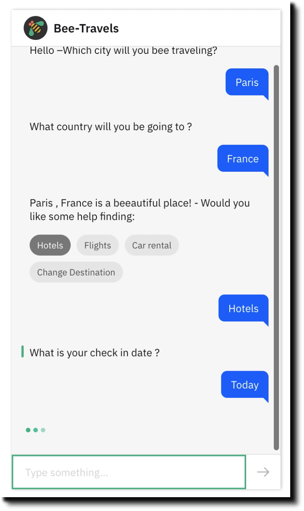

# Bee-Travels Chatbot 
> **Note:** Bee Travels Chat Bot is a work in progress. This document will be updated to reflect any changes.

<!-- 

 -->
## About

Bee Travels is a polyglot microservice demo in the form of a travel agency web application. This repo is home to the implementation of bee travel chatbots. The chatbots crated in this repo are used to demonstrate the key capability of Watson Assistant into the cloud native application. 

To see versions of Bee Travels for other languages, check out the [Bee Travels GitHub org](https://github.com/bee-travels).

## Basic Usage

### Prerequisite

- Register for an [IBM Cloud](https://www.ibm.com/account/reg/us-en/signup?formid=urx-42793&eventid=cfc-2020?cm_mmc=OSocial_Blog-_-Audience+Developer_Developer+Conversation-_-WW_WW-_-cfc-2020-ghub-starterkit-communication_ov75914&cm_mmca1=000039JL&cm_mmca2=10008917) account.

### Set up an instance of Watson Assistant

Log in to IBM Cloud and provision a Watson Assistant instance.

**Step 1.** From the [IBM Cloud catalog](https://cloud.ibm.com/catalog/services/watson-assistant), provision an an instance of **Watson Assistant**.
  

**Step 2.**  Launch the Watson Assistant service.

**Step 3.** Click **Create assistant** and follow [these detailed instructions](https://cloud.ibm.com/docs/assistant?topic=assistant-assistant-add) for how to create an assistant.
  

**Step 4.** Name the Watson Assistant instance **Bee Travels**
  
**Step 5.** Click **Add Dialog skill** to add this to your assistant. Follow [the documentation](https://cloud.ibm.com/docs/assistant?topic=assistant-skill-dialog-add) if you have questions.

**Step 6.** Click **Import skill > Choose JSON file** and import the [`skill-travelBot.json`](./travelBot/skills/skill-travelBot.json) file.
  

**Step 7.** Go back to the All Assistants page. From the action menu ( **`⋮`** ), open **Settings**.
  

**Step 8.**  On the Settings tab, click **API Details** on the left and make a note of the `Assistant ID` and `Api Key` for future use.
  

**Step 9.** Go back to the All Assistants page and click on the **Skills** link.
  

**Step 10.** On the Skill page, click on the action menu ( **`⋮`** ), open **View API Details**.
 

**Step 11.** On the Skill Details page, make note of the `Skill ID` for future use.
  

**Step 12.**  Go back to your dialog skill and click on the **Preview Link** button on the side to get a link to test and verify your assistant.
  

**Step 13.** Ask the Watson Assistant chatbot some questions about where you will be traveling.

